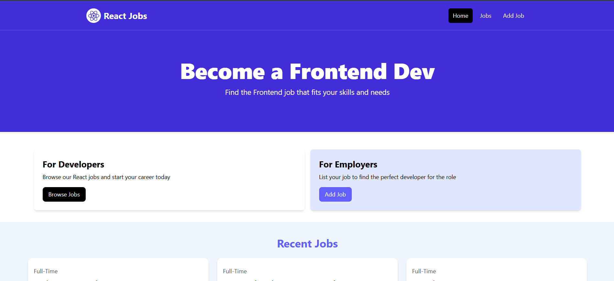
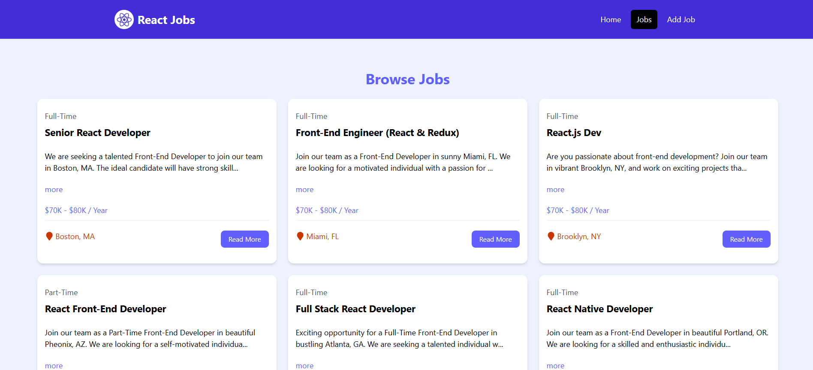
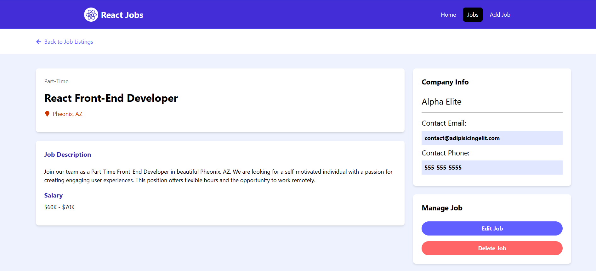
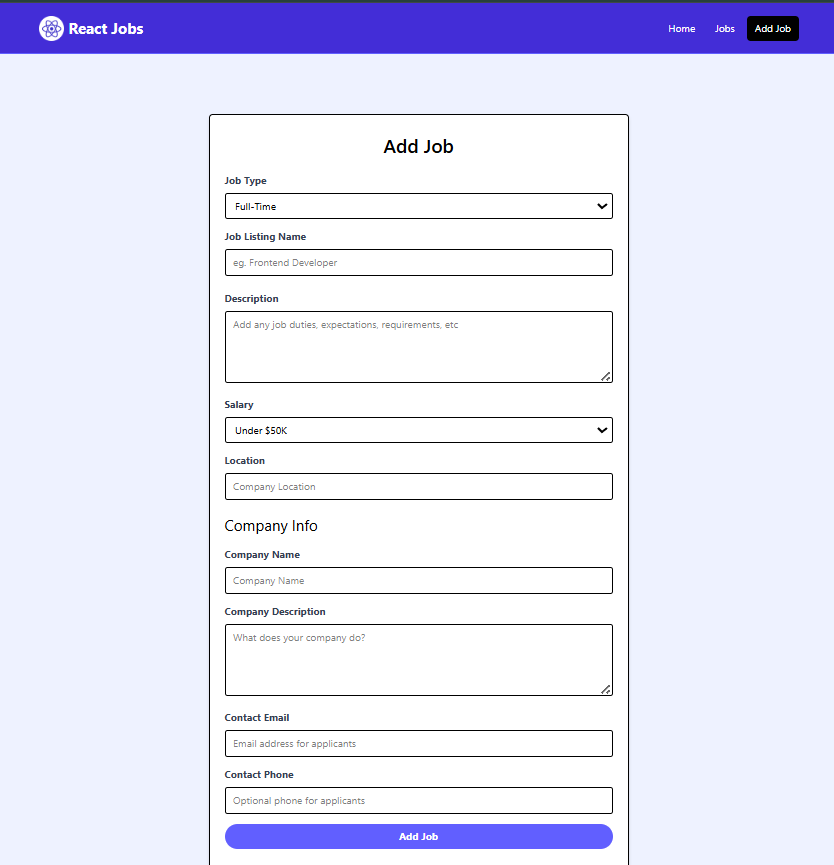
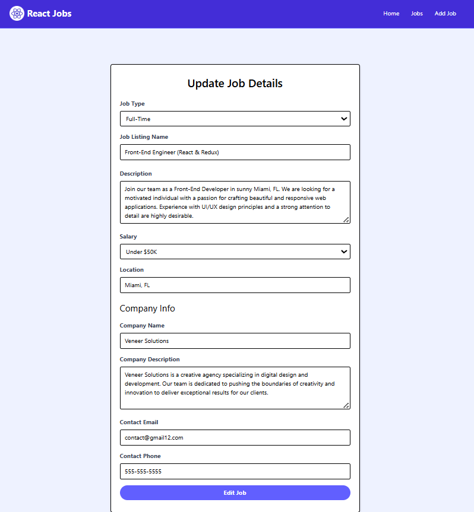

# React Jobs Portal

## Overview

React Jobs Portal is a frontend web application that demonstrates a complete job management workflow using modern React development practices. The application allows users to browse job listings, view detailed job information, and perform CRUD operations such as creating, editing, and deleting job postings.

The project is designed to showcase practical frontend engineering concepts including component-based architecture, client-side routing, asynchronous data handling, and interaction with REST-style APIs. A mock backend powered by JSON Server is used to simulate real API interactions.

---

## Features

* Browse available job listings
* View detailed information about a specific job
* Add new job postings
* Edit existing job postings
* Delete job listings
* Client-side routing using React Router
* Loading indicators during asynchronous operations
* Toast notifications for user feedback
* Responsive UI built with Tailwind CSS

---

## Technology Stack

### Frontend

* React
* Vite
* Tailwind CSS
* React Router DOM
* React Icons
* React Toastify
* React Spinners

### Backend (Mock API)

* JSON Server

---

## Application Preview

### Home Page



---

### Job Listings



---

### Job Details



---

### Add Job



---

### Edit Job



---

## Project Structure

```
src
│
├── components
│   ├── Cards.jsx
│   ├── Hero.jsx
│   ├── HomeCards.jsx
│   ├── Job.jsx
│   ├── JobListings.jsx
│   ├── Navbar.jsx
│   ├── SingleJob.jsx
│   ├── Spinner.jsx
│   └── ViewAllJobs.jsx
│
├── pages
│   ├── AddJobPage.jsx
│   ├── EditJobPage.jsx
│   ├── HomePage.jsx
│   ├── JobsPage.jsx
│   ├── NotFoundPage.jsx
│   └── SingleJobPage.jsx
│
├── layouts
│   └── MainLayout.jsx
│
├── App.jsx
├── main.jsx
└── jobs.json
```

---

## API Design

The application uses JSON Server to simulate a REST API.

Base URL:

```
http://localhost:5000/jobs
```

Supported endpoints:

```
GET     /jobs
GET     /jobs/:id
POST    /jobs
PUT     /jobs/:id
DELETE  /jobs/:id
```

---

## Installation

Clone the repository:

```
git clone https://github.com/yourusername/react-jobs.git
```

Navigate to the project directory:

```
cd react-jobs
```

Install dependencies:

```
npm install
```

---

## Running the Application

Start the React development server:

```
npm run dev
```

Start the mock API server:

```
npm run server
```

The API will be available at:

```
http://localhost:5000/jobs
```

---

## Learning Outcomes

This project demonstrates the following concepts:

* Building modern React applications with functional components
* Managing state using React hooks
* Implementing client-side routing with React Router
* Handling asynchronous data fetching
* Performing CRUD operations using REST APIs
* Creating reusable UI components
* Structuring scalable frontend projects
* Providing user feedback with loaders and notifications

---

## Future Improvements

Potential enhancements for this project include:

* Authentication and user accounts
* Integration with a real backend (Node.js / Express / MongoDB)
* Job search and filtering functionality
* Pagination for large job datasets
* Saved or bookmarked jobs
* Improved form validation and error handling

---

## Author

Vishnu S
